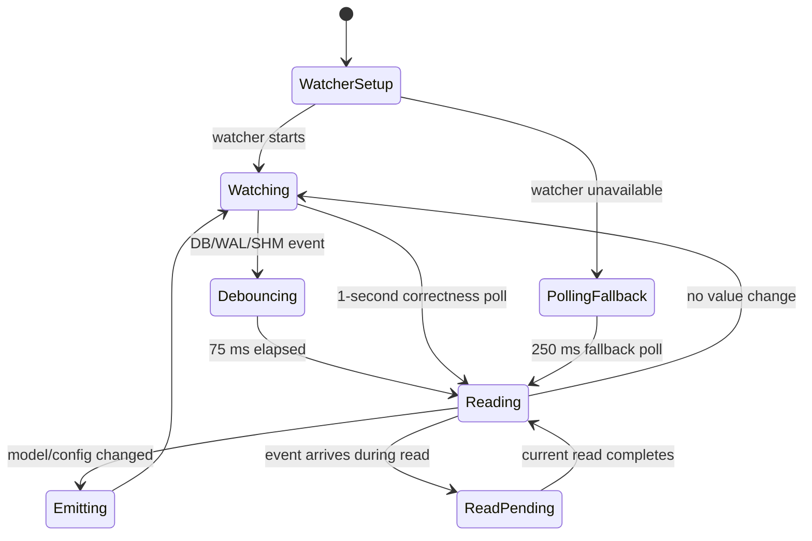

```mermaid
stateDiagram-v2
    [*] --> WatcherSetup
    WatcherSetup --> Watching: watcher starts
    WatcherSetup --> PollingFallback: watcher unavailable

    Watching --> Debouncing: DB/WAL/SHM event
    Debouncing --> Reading: 75 ms elapsed
    Reading --> Watching: no value change
    Reading --> Emitting: model/config changed
    Emitting --> Watching

    Reading --> ReadPending: event arrives during read
    ReadPending --> Reading: current read completes

    Watching --> Reading: 1-second correctness poll
    PollingFallback --> Reading: 250 ms fallback poll
```