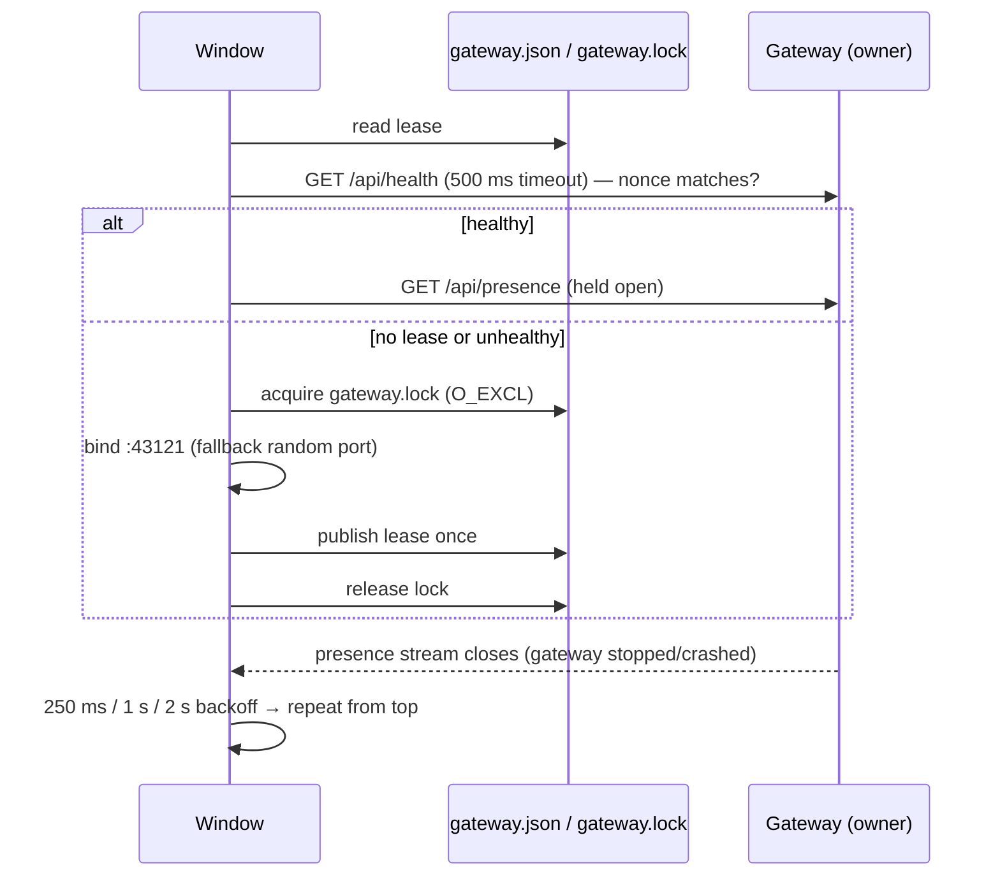

# Copilot Monitor — Architecture

This document describes how the extension observes GitHub Copilot Chat and relays it to the
dashboard and the mobile app. The design goal is simple to state and strict to honour:

> **Nothing runs unless something changed, and nothing is read that is not needed.**

There are no periodic polls, no scheduled exports, and no full re-reads of session files.
Every piece of work is triggered by a file-system event, a connection event, or a user action.

## 1. Why the previous design hung the machine

The first implementation combined four things that are individually tolerable and jointly
catastrophic on a busy machine with large chats:

| Old behaviour | Cost |
|---|---|
| Exported the live chat through VS Code every 2 s per active session | Serialised multi‑MB session objects on the extension host continuously |
| Polled SQLite and the file system on fixed intervals | Woke the process even when nothing changed |
| Re-read whole `chatSessions/*.jsonl` logs on every change (files reach hundreds of MB) | O(file size) per keystroke of the assistant |
| Recursive `fs.watch` over broad directories | Storms of events for unrelated files |

The redesign replaces each of these with an event-driven, incremental equivalent.

## 2. Components

```mermaid
flowchart LR
    subgraph window["Each VS Code window (extension host)"]
        core[SessionCore]
        mon[SessionMonitor]
        bridge[MonitorServer<br/>127.0.0.1:random]
        reg[WindowRegistry]
        coord[GatewayCoordinator]
        core --> mon --> bridge
        reg -. descriptor file .-> registryDir[(shared/windows/*.json)]
    end

    subgraph gateway["Exactly one window per host"]
        agg[AggregateMonitor]
        gw[GatewayServer<br/>0.0.0.0:43121]
        agg --> gw
    end

    registryDir -. fs.watch .-> agg
    agg == SSE /api/events?relay=1 ==> bridge
    coord -. GET /api/presence (held open) .-> gw
    gw == SSE /api/events ==> dash[Browser dashboard]
    gw == SSE /api/events ==> mobile[Mobile app]
```

* **SessionCore** (`sessionCore.ts`) — pure Node, no `vscode` dependency. Owns the watchers,
  the per-session digest sync, the live tails of *watched* sessions and the merge that yields
  `ActiveSessionState[]`.
* **SessionDigest / SessionDigestBuilder** (`sessionDigest.ts`, `sessionDigestBuilder.ts`,
  `sessionDigestWorker.ts`) — the on-disk, per-workspace SQLite digest of session logs
  (section 6.1) and the streaming builder that keeps it current.
* **SessionMonitor** (`sessionMonitor.ts`) — adapts SessionCore to VS Code: commands
  (send, approve, model selection…), the model catalog, history paging and the on-demand
  *export snapshot*.
* **MonitorServer** — loopback bridge serving `MonitorState` over SSE to the gateway.
* **WindowRegistry / AggregateMonitor / GatewayCoordinator / GatewayServer** — the
  multi-window layer (section 7).

## 3. Data sources and their ranking

Copilot Chat leaves three on-disk traces. They are ranked, and the highest-ranked source
that has data for a turn wins:

| Rank | Source | Written by | Cadence | Used for |
|---|---|---|---|---|
| 1 | Copilot **transcript** `<workspaceStorage>/GitHub.copilot-chat/transcripts/<sid>.jsonl` | Copilot Chat extension, only when hooks are configured | Flushed before each hook (≤ 500 ms) | Live turns, tool calls, hook events |
| 2 | Copilot **debug log** `<workspaceStorage>/GitHub.copilot-chat/debug-logs/<sid>/main.jsonl` | Copilot Chat extension (`chatDebug.fileLogging.enabled`) | Every 4 s | Live turns when no transcript exists |
| 3 | VS Code **session log** `<workspaceStorage>/chatSessions/<sid>.jsonl` | VS Code core | On the 60 s idle storage flush; compaction rewrites in place above 1024 entries | Authoritative persisted history, titles, model state |
| — | **Session index** `state.vscdb` key `chat.ChatSessionStore.index` | VS Code core | On flush | Session list, titles, last message dates, `isEmpty` |
| — | **Model list** `User/globalStorage/state.vscdb` key `chat.cachedLanguageModels.v2` | VS Code core (`chatInputPart`) | When the picker's models change | Every model the panel can select, with VS Code's `configurationSchema` |
| — | **Panel selection** profile `state.vscdb` keys `chat.currentLanguageModel.panel` (PROFILE) and `chat.modelConfiguration.panel` (APPLICATION) | VS Code core | Immediately on user action | Model and effort/context of the chat VS Code has focused, seconds before the session log flushes |

Sources 1–2 are *live* (seconds), source 3 is *sealed* (tens of seconds). Section 6 explains
how they are merged.

The model list is filtered exactly like VS Code's own picker for a local chat (no
`targetChatSessionType`, not `isUserSelectable: false`), so the dashboard offers the same
models as the panel. Blank chats (`isEmpty`) are hidden unless they are the viewer's
selection, the chat VS Code has focused, or a chat a viewer just created.

## 4. Watching: `DirectoryWatcher`

`fs.watch` is used non-recursively on a handful of specific directories:

* `chatSessions/` for each open workspace (session log create/change/delete),
* the Copilot `transcripts/` directory (one `<sid>.jsonl` per session),
* the `debug-logs/<sid>/` directory of each *watched* session only,
* the directory containing `state.vscdb` (index changes),
* the window registry directory (gateway only).

Windows emits **no** event when the watched directory itself is deleted, so every
`DirectoryWatcher` also watches the nearest existing ancestor and re-arms itself, emitting a
`reconcile` event so callers re-list the directory. A watcher that fails to start retries
with a one-shot timer; there is no fallback poll.

## 5. Reading: `LineTailer`

Files are read **incrementally from a byte cursor**; file descriptors are never held open
between reads (VS Code and Copilot both rename/replace their files).

Each poke does one `stat` and, if the file grew, reads only the new bytes in 1 MB chunks,
yielding to the event loop between chunks, and emits complete lines. File identity is
verified before reading:

| Check | Signal | Reaction |
|---|---|---|
| inode changed | file rotated / replaced | `reset('rotated')`, resume near EOF |
| size < cursor | truncated (debug log 100 MB → 60 %, or `ftruncate(0)`) | `reset('truncated')` |
| anchor hash of the last 4 KB before the cursor differs | rewritten in place with the same inode (session log compaction) | `reset('rewritten')` |
| line longer than 64 MB | pathological input | skip the line, notify, keep going |

`initialOffset` lets a tailer start part-way into a file on first attach. Live logs use it
with `tailScan.ts`, which scans backwards in 256 KB blocks (at most 4 MB) for the line that
opens the second-last turn (`"type":"user.message"` / `"type":"user_message"`), so
attaching to a 90 MB debug log reads kilobytes, not the file.

## 6. Digest, live overlay and merge

### 6.1 `SessionDigest` — metadata first, history on disk

The session list is built from metadata only: the `state.vscdb` index, `fs.stat` of each
log, a 64 KB head read for sessions the index does not know yet, and directory events on
the live logs as a "working" signal. **No session log is parsed for the list.**

A session a client *watches* (section 8) gets a **digest**: one SQLite row per request in
`<workspaceStorage>/<extension>/history.db` holding the normalised `TranscriptTurn` the
clients render plus a compacted raw request (only the fields normalisation reads, strings
capped at 64 KB) so later mutations can be re-applied. The builder
(`sessionDigestBuilder.ts`) applies VS Code's `Initial` / `Set` / `Push` / `Delete` entries
with the semantics of `ObjectMutationLog._applySet/_applyPush`, one line at a time:

* lines up to 256 KB are `JSON.parse`d; longer ones — a compacted `Initial` entry is the
  whole session on **one line**, 100 MB and more — are tokenised with `stream-json`, so only
  one request object exists in memory at a time and every string is capped;
* the digest row records the byte offset it reflects plus the SHA-1 of the 4 KB before it;
  an append is consumed from that offset, a rewrite (compaction keeps the inode and often the
  first bytes) is detected by the anchor and rebuilt;
* VS Code never diffs a request again once `modelState` is Complete/Cancelled/Failed
  (`sealed` in `chatSessionOperationLog.ts`), so raw JSON is kept only for the newest 16
  requests; a mutation that nonetheless touches a trimmed row forces a rebuild;
* short appends are applied inline on the extension host; rebuilds and large appends run in
  a worker thread with its own connection (WAL mode; the host's connection waits at most
  250 ms for a lock and retries later).

History pages are `SELECT … WHERE idx BETWEEN`, so paging never touches the session log and
holds nothing beyond the rows of one page. Measured on a real 122 MB compacted log: first
attach 1.8 s in the worker, peak heap +19 MB, digest 11 MB, page of 20 in 17 ms, re-attach
with the digest on disk 0 ms.

### 6.2 `LiveTurnAccumulator`

Consumes transcript or debug log lines and produces `LiveTurn`s: user text, assistant
segments, tool calls (`__vscode-N` suffixes stripped), hook events. Debug log entries are
truncated at 5 KB by Copilot, so parsing is tolerant of cut-off JSON. Only the newest 8
turns are kept; older ones are already in the digest.

### 6.3 `mergeLiveTurns`

Live turns are aligned to persisted turns **from the end**, pairing a live turn with a
persisted turn only when the normalised user text matches **and** |Δt| ≤ 5 min. Sealed
persisted turns are never overridden by live data. Live data never claims a tool needs
approval: a tool on the newest working turn that is still unfinished 3 s after it appeared
triggers **one** stall-probe export (section 6.4), skipped entirely when the chat's
permission level auto-approves.

### 6.4 Export snapshot (on demand only)

`SessionMonitor.syncNow()` asks VS Code for the live session object once. Only the verdict is
kept: which tool calls of the newest request are held for confirmation (serialised
`isConfirmed` is `undefined` and there is no result — `ChatToolInvocation.toJSON`), plus the
live model state. `applyExportSnapshot` marks exactly those still-unfinished tools
`waiting` / `canApprove` and never replaces turn text, blocks or other tools, so live
progress keeps streaming after an export. An approval decision re-exports to refresh the
verdict. The export runs only for a stall probe, a user-initiated sync
(`POST /api/sessions/sync`), a tool decision, or after a command that changes model state;
there is no scheduled export (it needs the chat focused in VS Code, so polling would steal
focus).

## 7. Multi-window layer

### 7.1 Discovery — `WindowRegistry`

Each window writes **one** descriptor `<shared>/windows/<windowId>.json` (atomic
temp+rename) when it starts and deletes it when it stops. There are no heartbeats. A
`DirectoryWatcher` on the registry directory re-publishes the descriptor if something
deletes it. Temporary files and unparseable descriptors older than 60 s are garbage
collected by readers.

### 7.2 Liveness — `AggregateMonitor`

The gateway watches the registry directory and re-lists it 100 ms after any `.json` event.
For every descriptor it holds an SSE connection to the window's bridge. Liveness *is* that
connection: when it drops, the gateway reconnects after 0.5 s, 1.5 s and 4 s, and if all
fail it removes the window and **deletes its stale descriptor** (crashed window). While the
stream is open, nothing is scanned or probed.

### 7.3 Election — `GatewayCoordinator` and `GatewayLeaseStore`



* The lease is validated by asking the advertised port for its nonce, **never by age**, so the
  owner writes it exactly once. Only the election lock has a staleness window (8 s) so a
  crashed elector cannot block elections forever.
* Followers hold `GET /api/presence` open. Its closure is the signal that the gateway is gone;
  they re-run the election with a short backoff. Owners hold no connection.
* `GatewayCoordinator.onDidChangeAddress` fires when the resolved address changes; the
  sidebar QR view re-renders on that event instead of polling.

## 8. Viewer gating, watch scoping and the timer inventory

`SessionCore.setViewerCount(n)` is driven by the number of dashboard/phone SSE clients
(relayed through the gateway). With **zero viewers nothing is watched or tailed** — the
extension is idle until a browser or phone connects. With viewers, the list is kept current
from metadata alone.

Turns exist only for **watched** sessions. A client names the chat it is looking at on its
stream — `GET /api/events?v=2&watch=<windowId>|<sessionResource>` (repeatable) — so the
watch lives exactly as long as the stream and needs no lease or heartbeat. The gateway unions
every client's targets, forwards each window's share as `POST /api/clients {count, watched}`
(windows are updated one at a time, 100 ms apart, so five windows do not attach in the same
tick) and `SessionCore.setWatched()` attaches at most 3 sessions per window: digest sync,
newest 8 digest turns in memory, tail-first live logs. A session stays attached for 60 s
after its last watcher left, so a phone that goes to the background briefly does not redo
the attach. Clients that never send `watch` receive metadata only (`turns: []`); the
capability `lazyHistory` in `/api/health` announces this.

Timers that still exist, and when they run:

| Timer | Kind | Runs only while |
|---|---|---|
| File-event debounce 50 ms, index debounce 400 ms | one-shot | an event was just received |
| Activity decay 15 s | one-shot | a session was recently marked *working* |
| Unwatch grace 60 s | one-shot | a watched session lost its last watcher |
| Viewer fan-out spacing 100 ms | one-shot | the gateway is pushing a viewer change to several windows |
| Stall probe 3 s | one-shot | a live tool has been outstanding and viewers exist |
| Digest retry 1/2 s | one-shot | a digest sync failed (at most 3 times per attach) |
| Watcher retry, reconnects (0.5/1.5/4 s), presence backoff (0.25/1/2 s) | one-shot | something is broken |
| SSE keepalive comment 15 s | interval | at least one SSE stream is open |

There is no `setInterval` that runs while the system is idle and healthy.

## 9. Wire protocol

`MonitorState` (per window) and `GatewayState` (aggregate) keep their shape. `GET /api/health`
reports `apiVersion: 4` and the capabilities `sessionSync`, `eventsV2`, `remoteAccess` and
`lazyHistory`.

| Endpoint | Purpose |
|---|---|
| `GET /api/events` | Protocol 1: every change is a full `event: state` frame |
| `GET /api/events?v=2&watch=…` | Protocol 2: one `event: snapshot`, then `event: patch` deltas; `watch` names the chats whose turns are wanted |
| `POST /api/sessions/history` | Page persisted turns of a digested chat (`before`, `limit ≤ 40`) |
| `POST /api/sessions/sync` | Request one export snapshot for a session (user action) |
| `GET /api/presence` (gateway) | Idle SSE stream followers hold open; does not count as a dashboard client |
| `POST /api/auth` (gateway) | Browser-only: trades the pairing secret for an `HttpOnly; SameSite=Strict` cookie |
| `GET` / `POST /api/remote-access` (gateway) | Machine-wide remote access (dev tunnel on/off, manual URL, tunnel state); every window manages it through the owner |

### 9.0 Pairing secret and reachability (`gatewayAuth.ts`, `hostIdentity.ts`)

Every `/api/*` route on the shared gateway except `/api/health` and `/api/auth` requires the
host's **pairing secret**, presented as `Authorization: Bearer <secret>` (apps, follower
windows) or as the `cm_auth` cookie (browser dashboard, because `EventSource` cannot set
headers). The secret is 32 random bytes, created exclusively (`wx`, mode 0600) in the shared
state directory next to `host.json`, so concurrent windows converge on one value and gateway
failover keeps it. Comparison is constant-time. The gateway caches the secret and re-reads
the file (throttled to once per 2 s) when a token it does not know arrives, so
`Copilot Monitor: Reset Pairing Secret` from any window converges without restarts.

The QR code / pairing link is `http://<lan-ip>:<port>/#k=<secret>`: the fragment never
reaches the server, its logs, or a tunnel provider. The dashboard posts it to `/api/auth`
once and strips it from the address bar. `SameSite=Strict` plus the JSON `Content-Type`
requirement blocks cross-site requests; no CORS headers are issued.

`/api/health` is public (it carries only identifiers) and additionally reports
`authRequired`, `authorized` (whether *this* request carried a valid token) and
`endpoints`: every URL the gateway can be reached through — all physical LAN IPv4
interfaces plus the `githubCopilotMonitor.remoteUrl` setting. Phones persist the list and,
when the last-good address fails, probe LAN candidates in parallel, then remote ones, then
scan the subnet (`mobile/src/transport/host-locator.ts`). Remote access (`remoteTunnel.ts`) runs
the `code-tunnel` CLI shipped inside VS Code with `tunnel forward-internal --provider github`,
the same stdin (port list JSON) / stderr (`{"port_format"}`) protocol the built-in Ports view
uses, authenticated with a token from `vscode.authentication.getSession('github', …)`. The CLI
is a per-machine singleton with a stable address, so multiple windows and the Ports view can
share it. Only the gateway owner runs it; the on/off choice and an optional manual URL are
stored in `<shared>/remote-access.json` (not VS Code settings, whose writer rejects keys the
running window has not registered) and every window reads/changes them via
`/api/remote-access`, so the sidebar behaves identically in owner and follower windows.
`env.asExternalUri` is a no-op in local windows and `workspace.openTunnel` is a proposed API,
which is why the CLI is driven directly.

### 9.1 Protocol 2 deltas (`stateDelta.ts`, `stateStream.ts`)

A patch is a JSON tuple that turns the client's previous state into the next one:

| Op | Meaning |
|---|---|
| `['=', value]` | replace |
| `['-']` | delete an object member (only inside `'o'`) |
| `['+', suffix]` | append to a string — streaming assistant text and tool output travel as their new tail only |
| `['o', {key: patch}]` | patch object members |
| `['a', length, {index: patch}]` | positional array patch (resize, then patch indices) |
| `['k', keys, {key: patch}]` | keyed array patch: rebuild in `keys` order from the previous items (`id` / `resource` / `windowId` / `identifier`), so a sliding turn window sends only the new turn |

The server (`StateStreamHub`) keeps an **independent copy** of the latest state per hub,
advanced by applying the very patch it sends, so a backend that mutates objects in place
cannot desynchronise clients. All clients at the newest generation share one patch string;
a client whose socket was waiting for `drain` receives a single catch-up patch computed from
the generation it last received. A client that fails to apply a patch simply reconnects and
gets a fresh snapshot. The same codec is used on the gateway→window relay link, in the
browser dashboard (inline port) and in the mobile app (`mobile/src/transport/state-delta.ts`).

On a small demo state the v2 stream carried 7× fewer bytes than v1 for identical changes;
the ratio grows with the size of the retained turn window.

## 10. Failure modes considered

| Situation | Handling |
|---|---|
| Session log compacted in place (same inode, shorter or same size) | digest anchor hash mismatch → rebuild in a worker from the compacted file |
| Debug log truncated to 60 % at 100 MB (new inode) | `rotated` reset, resume near EOF |
| `state.vscdb` locked mid-write | read returns `undefined`, retried with backoff up to 5× |
| Watched directory deleted and recreated | ancestor watcher re-arms and emits `reconcile` |
| Window crashes without removing its descriptor | gateway purges it after bounded reconnects |
| Gateway window closes | followers detect closed presence stream and elect a new owner on the same port |
| Preferred port taken by an unrelated program | owner falls back to a random port; followers find it through the lease + health nonce |
| Session file > 1 GB | marked oversized; not digested; history stays in VS Code |
| Mutation touches a request whose raw JSON was trimmed | `RebuildRequiredError` → one full rebuild |
| `history.db` locked by another window's worker | host connection gives up after 250 ms; sync retried (≤ 3×) |
| Line > 64 MB | skipped, reported, tailing continues |
| Transcript cannot distinguish "waiting for approval" from "running" | one export per slow tool reads the renderer's real confirmation state; no timer-based guess |

## 11. Verification

* Unit tests (`node:test`) cover the tailer identity checks, directory-watcher recovery,
  digest equivalence with a full replay (realistic and seeded random logs, incremental and
  from scratch, parsed whole and streamed), compaction detection, tail scanning, live merge
  alignment, session index reads, registry self-healing, dead-window purge, lease semantics,
  election/failover, watch routing and the HTTP surfaces.
* An integration test launches the extension in VS Code Insiders and checks the aggregate
  dashboard is served.
* The digest was validated against a real 122 MB compacted session log (55 requests):
  identical turns to a full replay, 1.8 s to build in a worker, +19 MB peak heap.
