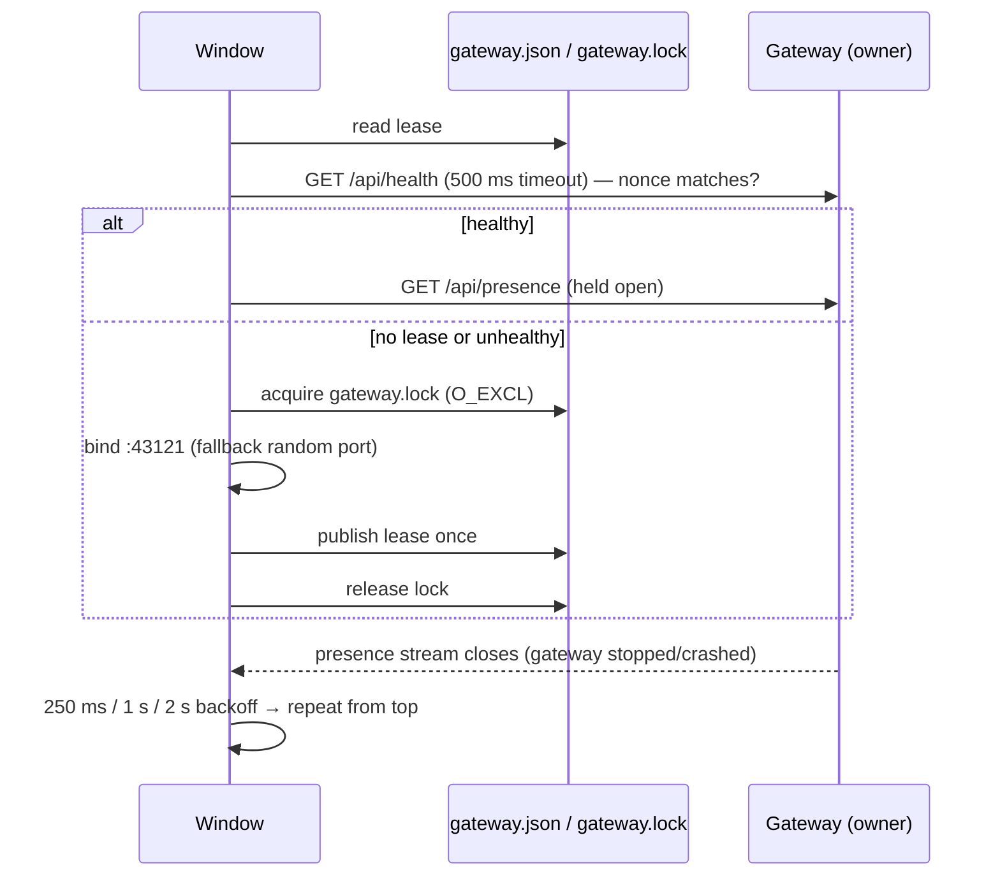

# Copilot Monitor — Architecture

This document describes how the extension observes GitHub Copilot Chat and relays it to the
dashboard and the mobile app. The design goal is simple to state and strict to honour:

> **Nothing runs unless something changed, and nothing is read that is not needed.**

There are no periodic polls, no scheduled exports, and no full re-reads of session files.
Every piece of work is triggered by a file-system event, a connection event, or a user action.

## 1. Why the previous design hung the machine

The first implementation combined four things that are individually tolerable and jointly
catastrophic on a busy machine with large chats:

| Old behaviour | Cost |
|---|---|
| Exported the live chat through VS Code every 2 s per active session | Serialised multi‑MB session objects on the extension host continuously |
| Polled SQLite and the file system on fixed intervals | Woke the process even when nothing changed |
| Re-read whole `chatSessions/*.jsonl` logs on every change (files reach hundreds of MB) | O(file size) per keystroke of the assistant |
| Recursive `fs.watch` over broad directories | Storms of events for unrelated files |

The redesign replaces each of these with an event-driven, incremental equivalent.

## 2. Components

```mermaid
flowchart LR
    subgraph window["Each VS Code window (extension host)"]
        core[SessionCore]
        mon[SessionMonitor]
        bridge[MonitorServer<br/>127.0.0.1:random]
        reg[WindowRegistry]
        coord[GatewayCoordinator]
        core --> mon --> bridge
        reg -. descriptor file .-> registryDir[(shared/windows/*.json)]
    end

    subgraph gateway["Exactly one window per host"]
        agg[AggregateMonitor]
        gw[GatewayServer<br/>0.0.0.0:43121]
        agg --> gw
    end

    registryDir -. fs.watch .-> agg
    agg == SSE /api/events?relay=1 ==> bridge
    coord -. GET /api/presence (held open) .-> gw
    gw == SSE /api/events ==> dash[Browser dashboard]
    gw == SSE /api/events ==> mobile[Mobile app]
```

* **SessionCore** (`sessionCore.ts`) — pure Node, no `vscode` dependency. Owns the watchers,
  tailers, projections and the merge that yields `ActiveSessionState[]`.
* **SessionMonitor** (`sessionMonitor.ts`) — adapts SessionCore to VS Code: commands
  (send, approve, model selection…), the model catalog, oversized-history paging and the
  on-demand *export snapshot*.
* **MonitorServer** — loopback bridge serving `MonitorState` over SSE to the gateway.
* **WindowRegistry / AggregateMonitor / GatewayCoordinator / GatewayServer** — the
  multi-window layer (section 7).

## 3. Data sources and their ranking

Copilot Chat leaves three on-disk traces. They are ranked, and the highest-ranked source
that has data for a turn wins:

| Rank | Source | Written by | Cadence | Used for |
|---|---|---|---|---|
| 1 | Copilot **transcript** `<workspaceStorage>/GitHub.copilot-chat/transcripts/<sid>.jsonl` | Copilot Chat extension, only when hooks are configured | Flushed before each hook (≤ 500 ms) | Live turns, tool calls, hook events |
| 2 | Copilot **debug log** `<workspaceStorage>/GitHub.copilot-chat/debug-logs/<sid>/main.jsonl` | Copilot Chat extension (`chatDebug.fileLogging.enabled`) | Every 4 s | Live turns when no transcript exists |
| 3 | VS Code **session log** `<workspaceStorage>/chatSessions/<sid>.jsonl` | VS Code core | On the 60 s idle storage flush; compaction rewrites in place above 1024 entries | Authoritative persisted history, titles, model state |
| — | **Session index** `state.vscdb` key `chat.ChatSessionStore.index` | VS Code core | On flush | Session list, titles, last message dates |

Sources 1–2 are *live* (seconds), source 3 is *sealed* (tens of seconds). Section 6 explains
how they are merged.

## 4. Watching: `DirectoryWatcher`

`fs.watch` is used non-recursively on a handful of specific directories:

* `chatSessions/` for each open workspace (session log create/change/delete),
* the Copilot `transcripts/` directory (one `<sid>.jsonl` per session),
* the `debug-logs/<sid>/` directory of the *selected* session only,
* the directory containing `state.vscdb` (index changes),
* the window registry directory (gateway only).

Windows emits **no** event when the watched directory itself is deleted, so every
`DirectoryWatcher` also watches the nearest existing ancestor and re-arms itself, emitting a
`reconcile` event so callers re-list the directory. A watcher that fails to start retries
with a one-shot timer; there is no fallback poll.

## 5. Reading: `LineTailer`

Files are read **incrementally from a byte cursor**; file descriptors are never held open
between reads (VS Code and Copilot both rename/replace their files).

Each poke does one `stat` and, if the file grew, reads only the new bytes in 4 MB chunks and
emits complete lines. File identity is verified before reading:

| Check | Signal | Reaction |
|---|---|---|
| inode changed | file rotated / replaced | `reset('rotated')`, resume near EOF |
| size < cursor | truncated (debug log 100 MB → 60 %, or `ftruncate(0)`) | `reset('truncated')` |
| anchor hash of the last 4 KB before the cursor differs | rewritten in place with the same inode (session log compaction) | `reset('rewritten')` |
| line longer than 64 MB | pathological input | skip the line, notify, keep going |

`skipToTailIfLargerThan` lets a tailer start at the end of a huge file (debug log) instead
of reading history that is never displayed.

## 6. Projection and merge

### 6.1 `SessionLogProjection`

The session log is a sequence of VS Code `Initial` + mutation entries (`_applySet`,
`_applyPush`, …). The projection applies them **one line at a time**, keeping only:

* metadata (title, model, permission level, turn count, status),
* the newest 40 turns in full,
* compacted summaries for older turns (bounded characters).

It was verified byte-identical against a full replay on real 2 MB and 46 MB logs. A reset
from the tailer clears the projection; sessions above 256 MB are marked *oversized* and
their history is served through the paged mutation worker instead of being projected.

### 6.2 `LiveTurnAccumulator`

Consumes transcript or debug log lines and produces `LiveTurn`s: user text, assistant
segments, tool calls (`__vscode-N` suffixes stripped), hook events. Debug log entries are
truncated at 5 KB by Copilot, so parsing is tolerant of cut-off JSON.

### 6.3 `mergeLiveTurns`

Live turns are aligned to persisted turns **from the end**, pairing a live turn with a
persisted turn only when the normalised user text matches **and** |Δt| ≤ 5 min. Sealed
persisted turns are never overridden by live data. Live tool calls outstanding for ≥ 2 s
become `canApprove: true`; the first such tool also triggers **one** stall-probe export
(section 6.4) so the dashboard learns whether VS Code is really waiting for approval.

### 6.4 Export snapshot (on demand only)

`SessionMonitor.syncNow()` asks VS Code for the live session object once and overlays it on
the newest working turn. It runs only for a stall probe, a user-initiated sync
(`POST /api/sessions/sync`), or after a command that changes model state. There is no
scheduled export.

## 7. Multi-window layer

### 7.1 Discovery — `WindowRegistry`

Each window writes **one** descriptor `<shared>/windows/<windowId>.json` (atomic
temp+rename) when it starts and deletes it when it stops. There are no heartbeats. A
`DirectoryWatcher` on the registry directory re-publishes the descriptor if something
deletes it. Temporary files and unparseable descriptors older than 60 s are garbage
collected by readers.

### 7.2 Liveness — `AggregateMonitor`

The gateway watches the registry directory and re-lists it 100 ms after any `.json` event.
For every descriptor it holds an SSE connection to the window's bridge. Liveness *is* that
connection: when it drops, the gateway reconnects after 0.5 s, 1.5 s and 4 s, and if all
fail it removes the window and **deletes its stale descriptor** (crashed window). While the
stream is open, nothing is scanned or probed.

### 7.3 Election — `GatewayCoordinator` and `GatewayLeaseStore`



* The lease is validated by asking the advertised port for its nonce, **never by age**, so the
  owner writes it exactly once. Only the election lock has a staleness window (8 s) so a
  crashed elector cannot block elections forever.
* Followers hold `GET /api/presence` open. Its closure is the signal that the gateway is gone;
  they re-run the election with a short backoff. Owners hold no connection.
* `GatewayCoordinator.onDidChangeAddress` fires when the resolved address changes; the
  sidebar QR view re-renders on that event instead of polling.

## 8. Viewer gating and the timer inventory

`SessionCore.setViewerCount(n)` is driven by the number of dashboard SSE clients (relayed
through the gateway). With **zero viewers nothing is watched, tailed or projected** — the
extension is idle until a browser or phone connects.

Timers that still exist, and when they run:

| Timer | Kind | Runs only while |
|---|---|---|
| File-event debounce 50 ms, index debounce 400 ms | one-shot | an event was just received |
| Activity decay 15 s | one-shot | a session was recently marked *working* |
| Stall probe 3 s | one-shot | a live tool has been outstanding and viewers exist |
| Watcher retry, reconnects (0.5/1.5/4 s), presence backoff (0.25/1/2 s) | one-shot | something is broken |
| SSE keepalive comment 15 s | interval | at least one SSE stream is open |

There is no `setInterval` that runs while the system is idle and healthy.

## 9. Wire protocol

`MonitorState` (per window) and `GatewayState` (aggregate) are unchanged from 1.1.x so the
dashboard and mobile app keep working. `GET /api/health` reports `apiVersion: 4` and the
capability `sessionSync`. New endpoints:

| Endpoint | Purpose |
|---|---|
| `POST /api/sessions/sync` | Request one export snapshot for a session (user action) |
| `GET /api/presence` (gateway) | Idle SSE stream followers hold open; does not count as a dashboard client |

## 10. Failure modes considered

| Situation | Handling |
|---|---|
| Session log compacted in place (same inode, shorter or same size) | anchor hash mismatch → projection reset and replay of the compacted file |
| Debug log truncated to 60 % at 100 MB (new inode) | `rotated` reset, resume near EOF |
| `state.vscdb` locked mid-write | read returns `undefined`, retried with backoff up to 5× |
| Watched directory deleted and recreated | ancestor watcher re-arms and emits `reconcile` |
| Window crashes without removing its descriptor | gateway purges it after bounded reconnects |
| Gateway window closes | followers detect closed presence stream and elect a new owner on the same port |
| Preferred port taken by an unrelated program | owner falls back to a random port; followers find it through the lease + health nonce |
| Session file > 256 MB | marked oversized; history served by the paged mutation worker; not projected |
| Line > 64 MB | skipped, reported, tailing continues |
| Transcript cannot distinguish "waiting for approval" from "running" | optimistic `canApprove` after 2 s + one stall-probe export |

## 11. Verification

* Unit tests (`node:test`) cover the tailer identity checks, directory-watcher recovery,
  projection equivalence, live merge alignment, session index reads, registry self-healing,
  dead-window purge, lease semantics, election/failover and the HTTP surfaces.
* An integration test launches the extension in VS Code Insiders and checks the aggregate
  dashboard is served.
* The projection was validated against real session logs (2 MB and 46 MB) by comparing the
  incremental result with a full replay.
